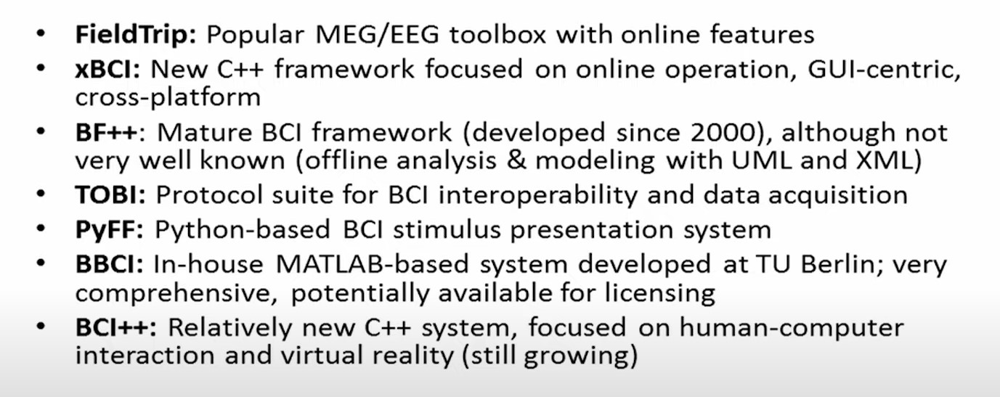

# Lec1 Introduction to BCI

### Definition

- The goal of BCI was to give significantly paralyzed people another way to communicate, a way that does not depend on muscle control.
- A system which takes a biosignal measured from a person and predicts (in real time / on a single-trial basis) some abstract aspect of the person’s cognitive state.
  - f: biosignal -> cognitive state: in real time or on a sing-trail basis

### Types

- Active BCI: derive output controlled by user consciously but independently from external events  
- Reactive BCI: reaction to external stimulation
- Passive BCI: collecting arbitrary brain activities, can be parallelizing 

### Input: bio-signals

Brain signals

- EEG: electrical field, w/ w/o gel
- fNIRS: blood oxygen level, low resolution in time and space
- ECoG, Microarrays, Neurochips: invasive brain signals
- MEG, fMRI: magnetic field

Non-brain signals

- Motion capture
- eye capture
- EMG, ECG, EOG
- system/ application state: stimulus, current vehicle speed, ...
- environment signals: temperature, ...

### Output: cognitive state

- tonic state: relaxation degree, cognitive load, ...
- phasic state: switching attention, type of imagined movement, ...
- event-relate state: surprised or not, committed error, event noticed or not, ...

### Applications

- communication and control for severely disabled
- operator monitoring: braking intent while driving
- forensics: lie detection, brain fingerprinting, trust assessment
- entertainment: mood assessment, 
- Health: sleep state, neurorehabilitation
- Social: neuro-wear

### Challenge

- interdisciplinary: signal processing, ML, neuroscience, cognitive science
- variability: person/task specific
  - different folding of cortex between people
  - diff relevant functional map
  - diff sensor loc
  - variable brain dynamics
- signal-to-noise ratio is high
- specific measures are hard to obtain with coarse-grained sensing
- underlying phenomena of brain 
- EEG is complicate, all sensors record the same signal(superposition of all brain activity), can be handled(linear)

### Method

- sophisticated signal processing
- statistical approach
- calibration before using

### Tools

- BioSig: Matlab, old, offline, not easy to use

- BCI2000: C++, online, good doc, lack of signal processing

- OpenViBE: C++, visual programming, hard to extend

- g.BSanalyze: Matlab, commercial

- BCILAB: Matlab

  